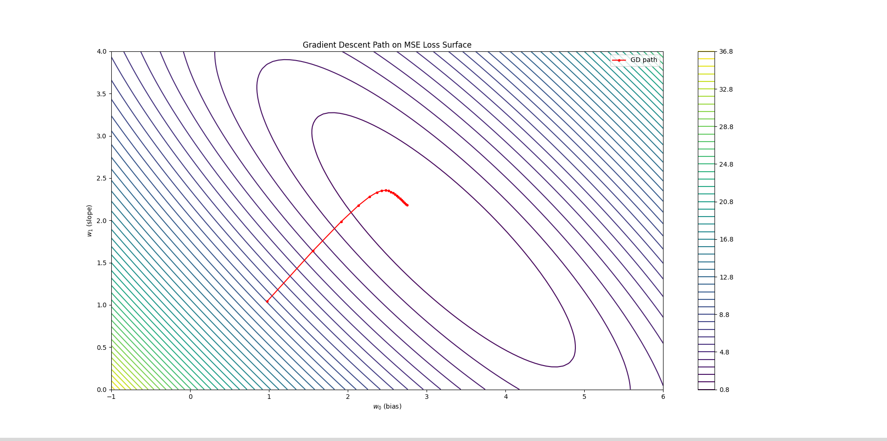
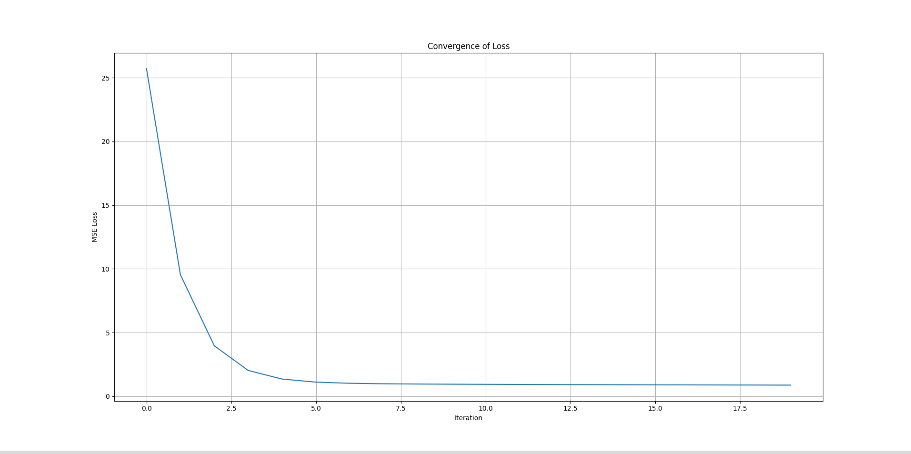
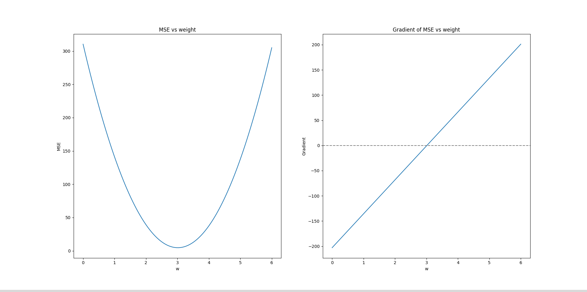
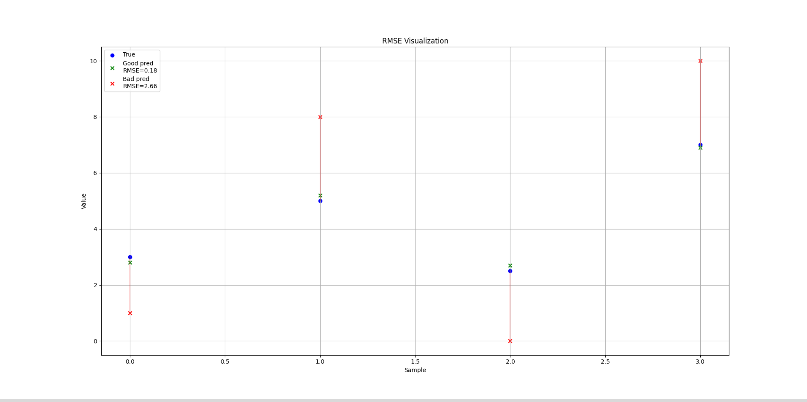
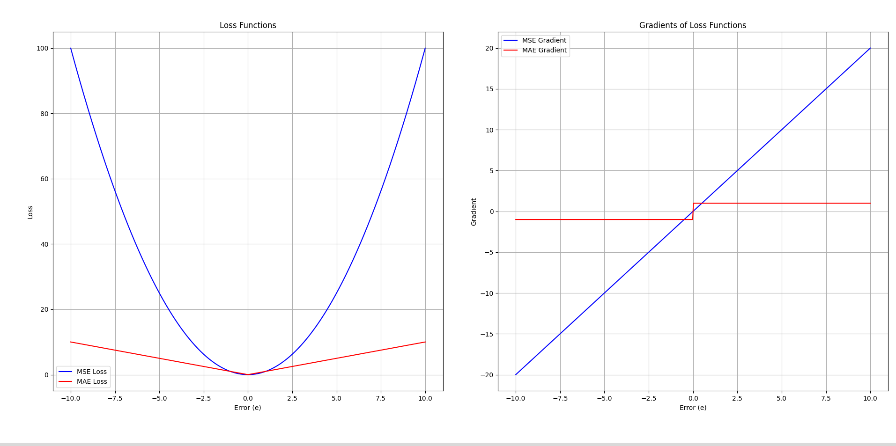
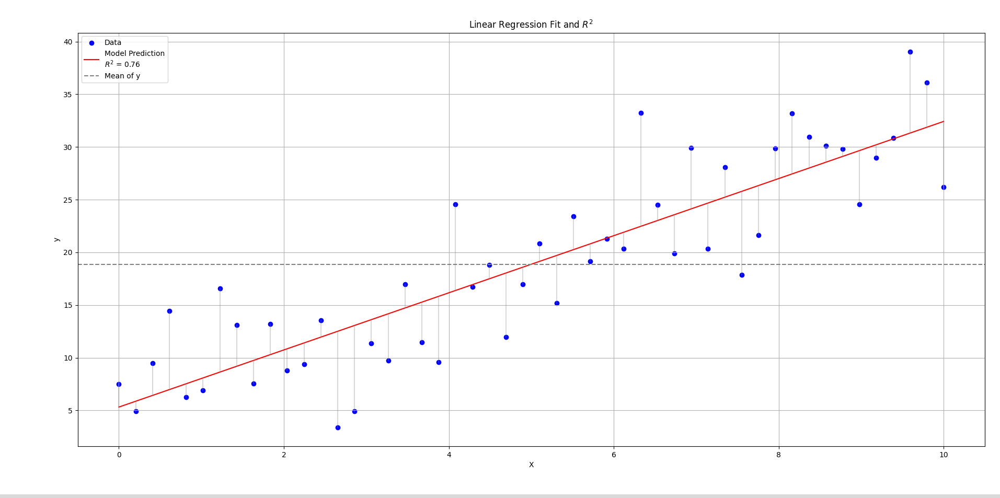

# Linear Regression: Complete Notes

## 1. **Problem Definition**

We model the relationship between dependent variable $y$ and independent variables $X$ as:

$$
y = X\beta + \epsilon
$$

Where: 

* **$\beta$** are model weights (including bias).
* **$\epsilon$** is random noise.

We estimate **$\beta$** such that prediction error is minimized.

---

## 2. **Loss Function**

We minimize the **Mean Squared Error (MSE):**

**$$
J(\beta) = \frac{1}{m} \sum_{i=1}^{m} \big( y_i - X_i^T \beta \big)^2
$$**

 

Why MSE?

* Convex: guarantees global minimum.
* Differentiable: supports gradient-based optimization.
* Penalizes larger errors more heavily than smaller ones.

Gradient of MSE:

**$$
\nabla_\beta J = \frac{2}{m} X^T (X\beta - y)
$$**

This compact matrix formula abstracts the partial derivatives of both bias and slope terms.

---

## 3. **Optimization Methods**

### 3.1 Normal Equation

**$$
\beta = (X^TX)^{-1}X^Ty
$$**

* Closed-form solution.
* Works if $X^TX$ is invertible.
* Computationally expensive for large $n$ (features).

### 3.2 Gradient Descent

Iteratively updates weights:

**$$
\beta^{(t+1)} = \beta^{(t)} - \eta \nabla_\beta J
$$**

* Works for large datasets.
* Requires choosing a learning rate $\eta$ and iterations.
* Needs feature scaling for convergence.

Visualisation:




* Loss decreasing over iterations.
* GD path converging on the MSE loss surface for a 2D toy example.

---

## 4. **Evaluation Metrics**

For regression tasks:

* **MSE:** mean squared error. 
* **RMSE:** root mean squared error. 
* **MAE:** mean absolute error. 
* **R² (coefficient of determination):** 

$$
R^2 = 1 - \frac{\text{SS}_{\text{res}}}{\text{SS}_{\text{tot}}}
$$


* **Adjusted R²:**
  Adjusts for number of predictors $p$ in the model.

---

## 5. **Assumptions of Linear Regression**

Why important? Because violating assumptions leads to invalid inferences.

| Assumption               | Meaning & Importance                                      |
| ------------------------ | --------------------------------------------------------- |
| **Linearity**            | True relationship between $y$ and $X$ is linear.          |
| **Independence**         | Residuals are uncorrelated.                               |
| **Homoscedasticity**     | Constant variance of residuals.                           |
| **No multicollinearity** | Predictors are not perfectly correlated.                  |
| **Normality of errors**  | Residuals follow $N(0, \sigma^2)$ — needed for inference. |

We derived and discussed why each exists.

---

## 6. **Notes**

* Feature scaling is **mandatory** for GD but not for normal equation.
* GD gradient:

  ```python
  gradients = (2/m) * X_bias.T @ error
  ```

  automatically computes both bias and feature weight gradients.
* Visualizations:

  * Loss vs iterations plot shows convergence.
  * GD path over MSE contours in 2D shows trajectory.

---

## 7. **Advanced Topics to Explore Before Logistic Regression**

* Model diagnostics:

  * Residual plots.
  * VIF (Variance Inflation Factor) for multicollinearity.
  * Q-Q plot for residual normality.
* Regularization:

  * Ridge (L2) and Lasso (L1) regression.
  * Why? To improve stability and prevent overfitting.
* Robust regressions (e.g., Huber loss, RANSAC).
* Feature engineering:

  * Polynomial features for nonlinearity.
  * Interaction terms.
* Interpretability:

  * Understand meaning of weights.
  * Report confidence intervals.

---

## 8. **Next Steps**

You now have a solid foundation for:

* Solving linear regression with multiple solvers (Normal Equation, GD, Sklearn API).
* Understanding and testing model assumptions.
* Evaluating model with correct metrics.
* Visualizing optimization process and diagnosing problems.

Before moving to logistic regression, it’s strongly recommended to:
✅ Run diagnostics and fix any issues on your linear model.
✅ Try regularized regression (Ridge/Lasso).
✅ Experiment with robust losses.

Then you’ll be fully prepared to tackle classification tasks with logistic regression.

---
